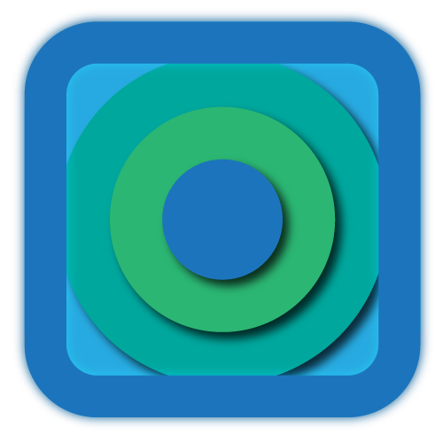

# Universal Code - Minimalist Code Editor

.png)
.png)

A distraction-free Electron-based code editor designed for focused single-file development. Perfect for quick edits and lightweight coding sessions.

- 🚀 **Lightning Fast** Launch and work instantly
- 📝 **Monaco Editor Core** (like VS Code)

## Installation

1. Download latest release from [Releases page](https://github.com/sncronus/universal-code/releases)
2. Run installer
3. Start coding!

3. **Language Support**:
   - JavaScript/TypeScript
   - Python
   - HTML/CSS
   - 20+ other languages

## Why Universal Code?

"Sometimes you just need to edit a single file without IDE overhead" - Our Philosophy

- Zero project configuration
- Session persistence (remembers last file)
- <3s cold start time

## License
Copyright © 2024 Sncronus. All rights reserved.

---

*Built with 💙*
